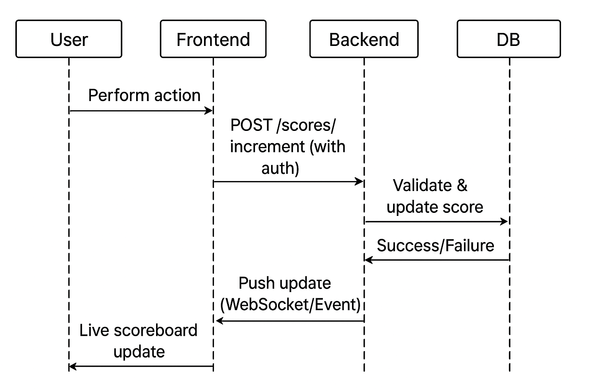

# Live Scoreboard API Module Specification

## Overview

This module provides backend API services for a website scoreboard. It manages user scores, supports live updates, and ensures secure score modifications.

### Requirements

1. **Scoreboard Display**: The website displays the top 10 users' scores.
2. **Live Updates**: The scoreboard updates in real-time as scores change.
3. **Score Increment**: Users can perform an action (details not required) that increases their score.
4. **API Call**: Upon action completion, an API call is dispatched to update the user's score on the server.
5. **Security**: Prevent unauthorized/malicious score increases.

## Execution Flow Diagram



### Score Update Flow  

1. **User Action**  
   - User performs an action that should increase their score.  

2. **Frontend Request**  
   - Frontend sends `POST /scores` with authentication token to the backend.  

3. **Backend Request Validation and Anti-Fraud Checks**  
   - Validate JWT token and extract `user_id`.  
   - Check rate limiting (reject if exceeded).  
   - Validate `action_id` uniqueness.  
   - Verify `action_type` and `points` are within allowed bounds.    
   - Check user’s recent activity patterns. 
   - Flag or reject suspicious behavior.  

4. **Backend Score Processing**  
   - Insert record into `score_history`.  
   - Atomically update the user’s `total_score` in the database.  
   - Update Redis cache for fast score retrieval.  
   - Publish message to score update queue.  

5. **Database Response**  
   - Database returns success or failure back to the backend.  

6. **Backend Response & Leaderboard Update**  
   - Return updated score and rank to the frontend.  
   - Check if the new score affects the leaderboard (e.g., top 10).  
   - Update leaderboard cache if necessary.  
   - Push WebSocket/Event update to frontend if rankings changed.  

7. **Frontend Update**  
   - Frontend receives the response and WebSocket update.  
   - Refresh scoreboard UI.  

8. **User Feedback**  
   - User sees their live updated score and leaderboard position.  

## Architecture Components

### Core Services
- **Score Update Service**: Processes score increment requests, validates actions, applies anti-fraud checks, and updates user scores securely in the database.
- **Leaderboard Service**: Calculates and maintains the top 10 user rankings, updates leaderboard data, and provides fast retrieval for display.
- **WebSocket Service**: Manages real-time communication channels, broadcasts live scoreboard updates to all connected clients, and ensures low-latency delivery.
- **Authentication Service**: Handles user authentication, session management, and enforces access control for all API endpoints.
- **Anti-Fraud Service**: Detects and prevents suspicious or unauthorized score changes using rate limiting, pattern analysis, and activity monitoring.

### Data Layer
- **Primary Database**: Persistent storage for user scores and metadata
- **Cache Layer**: Redis for fast leaderboard retrieval and session management
- **Message Queue**: For asynchronous processing of score updates

## API Endpoints

### POST /api/scores
Increments a user's score after completing an action.

**Headers:**
```
Authorization: Bearer <jwt_token>
Content-Type: application/json
```

**Request Body:**
```json
{
  "action_id": "uuid-v4-string",
  "action_type": "string",
  "points": "integer",
}
```

**Response (Success - 200):**
```json
{
  "success": true,
  "user_id": "integer",
  "new_score": "integer",
  "rank": "integer",
}
```

**Response (Error - 400/429/403):**
```json
{
  "success": false,
  "error_code": "RATE_LIMIT_EXCEEDED | INVALID_ACTION | UNAUTHORIZED",
  "message": "string",
  "retry_after": "integer (seconds, if applicable)"
}
```

### GET /api/scoreboard
Retrieves current top 10 leaderboard.

**Response (200):**
```json
{
  "leaderboard": [
    {
      "rank": 1,
      "user_id": "integer",
      "username": "string",
      "score": "integer",
      "last_updated": "ISO-8601-datetime"
    }
  ],
  "last_updated": "ISO-8601-datetime",
  "total_players": "integer"
}
```

### WebSocket /ws/scoreboard
Real-time scoreboard updates.

**Connection Headers:**
```
Authorization: Bearer <jwt_token>
```

**Message Types:**
```json
// Leaderboard update broadcast
{
  "type": "LEADERBOARD_UPDATE",
  "data": {
    "leaderboard": [...], // Same format as GET endpoint
    "changed_ranks": [1, 2, 5], // Positions that changed
    "timestamp": "ISO-8601-datetime"
  }
}

// Individual score update (only to the user)
{
  "type": "SCORE_UPDATE", 
  "data": {
    "new_score": "integer",
    "rank": "integer",
    "points_gained": "integer"
  }
}
```

## Security & Anti-Fraud Measures

### Authentication
- **JWT Validation**: Requests to protected endpoints must include a valid JWT in the `Authorization` header using the `Bearer` scheme. The token should be verified for integrity and expiration before processing.

- **Session Management**: Active session validation with Redis
- **Token Refresh**: Implement token rotation for long-lived sessions

### Rate Limiting
- **Per-User Limits**: Maximum 10 score updates per minute per user
- **Global Limits**: Maximum 1000 requests per minute across all users
- **Progressive Penalties**: Temporary bans for repeated violations

### Action Validation
- **Action ID Uniqueness**: Prevent duplicate action submissions
- **Temporal Validation**: Reject actions with suspicious timestamps
- **Client Signatures**: Optional cryptographic verification of client-side actions
- **Score Bounds**: Configurable maximum points per action type

### Suspicious Activity Detection
- **Velocity Checks**: Flag users with unusually rapid score increases
- **Pattern Analysis**: Detect automated or scripted behavior
- **IP Monitoring**: Track requests from suspicious IP addresses
- **Manual Review Queue**: Flag suspicious accounts for admin review

## Database Schema

### User Table
```sql
CREATE TABLE user (
  id INTEGER PRIMARY KEY AUTOINCREMENT,
  username VARCHAR(50) UNIQUE NOT NULL,
  is_active BOOLEAN DEFAULT true,
  created_at DATETIME DEFAULT CURRENT_TIMESTAMP,
  updated_at DATETIME DEFAULT CURRENT_TIMESTAMP
);
```

### Score Table
```sql
CREATE TABLE score (
  id INTEGER PRIMARY KEY AUTOINCREMENT,
  user_id INTEGER NOT NULL REFERENCES user(id),
  total_score BIGINT DEFAULT 0,
  updated_at DATETIME DEFAULT CURRENT_TIMESTAMP
);

CREATE INDEX idx_scores_total_score ON score (total_score DESC);
```

### Score History Table
```sql
CREATE TABLE score_history (
  id INTEGER PRIMARY KEY AUTOINCREMENT,
  user_id INTEGER NOT NULL REFERENCES user(id),
  action_id TEXT UNIQUE NOT NULL,
  action_type VARCHAR(50),
  points INTEGER,
  created_at DATETIME DEFAULT CURRENT_TIMESTAMP
);
```

### Leaderboard Cache (Redis)
```
Key: "leaderboard:top10"
Value: JSON array of top 10 users
TTL: 60 seconds

Key: "user:score:{user_id}"  
Value: Current user score
TTL: 300 seconds

Key: "rate_limit:{user_id}"
Value: Request count
TTL: 60 seconds
```

## Configuration

### Environment Variables
```env
# Database
DB_CONNECTION_STRING=
REDIS_URL=redis://...

# Security
JWT_SECRET=your-secret-key
JWT_EXPIRY=3600

# Rate Limiting
RATE_LIMIT_PER_USER=10
RATE_LIMIT_WINDOW=60

# Anti-Fraud
MAX_POINTS_PER_ACTION=1000
SUSPICIOUS_VELOCITY_THRESHOLD=100
MANUAL_REVIEW_THRESHOLD=10000

# WebSocket
WS_CONNECTION_LIMIT=1000
WS_HEARTBEAT_INTERVAL=30
```

## Monitoring & Observability

### Key Metrics
- **Request Rate**: Score update requests per second
- **Error Rate**: Failed requests percentage
- **WebSocket Connections**: Active real-time connections
- **Cache Hit Rate**: Redis cache performance
- **Database Performance**: Query response times
- **Fraud Detection**: Flagged actions per hour

### Logging Requirements
- All score updates with user_id, points, and timestamp
- Failed authentication attempts
- Rate limit violations
- Suspicious activity flags
- WebSocket connection/disconnection events

## Performance Requirements

### Response Times
- Score update API: < 200ms (95th percentile)
- Leaderboard retrieval: < 100ms (95th percentile) 
- WebSocket message delivery: < 50ms

### Scalability Targets
- Support 10,000 concurrent users
- Handle 1,000 score updates per second
- Maintain 5,000 active WebSocket connections

### Availability
- 99.9% uptime target
- Graceful degradation during high load
- Circuit breaker patterns for external dependencies

## Additional Improvements & Considerations

### Short-term Enhancements
1. **Batch Processing**: Implement batch score updates for high-throughput scenarios
2. **Geographic Distribution**: Add CDN support for global WebSocket connections
3. **Mobile Optimization**: Implement efficient mobile WebSocket reconnection logic
4. **A/B Testing**: Add feature flags for different anti-fraud strategies

### Long-term Considerations
1. **Historical Analytics**: Add time-series analysis for score trends
2. **Multi-tenancy**: Support multiple leaderboards/games

### Operational Excellence
1. **Blue-Green Deployment**: Zero-downtime deployments with WebSocket connection migration
2. **Database Sharding**: Prepare for horizontal scaling of score storage
3. **Disaster Recovery**: Cross-region backup and failover procedures
4. **Cost Optimization**: Implement data archiving for old score history

### Security Hardening
1. **API Gateway**: Centralized security, throttling, and monitoring
2. **Web Application Firewall**: DDoS protection and request filtering
3. **Audit Logging**: Comprehensive security event logging
4. **Penetration Testing**: Regular security assessments

### Developer Experience
1. **API Documentation**: Interactive OpenAPI/Swagger documentation
2. **SDK Development**: Client libraries for common platforms
3. **Testing Framework**: Comprehensive integration test suites
4. **Local Development**: Docker-based development environment


## Summary & Comments for Improvement

- Ensure all score updates are authenticated and validated server-side.
- Use WebSockets for real-time scoreboard updates to all clients.
- Rate-limit and log suspicious activity for anti-fraud protection.
- Consider caching leaderboard for performance.
- Add admin endpoints for monitoring and moderation.
- Document API with OpenAPI/Swagger for easy integration.
- Implement audit logging and regular security reviews.

---
This specification is intended for backend engineering teams to implement a secure, real-time scoreboard API service.